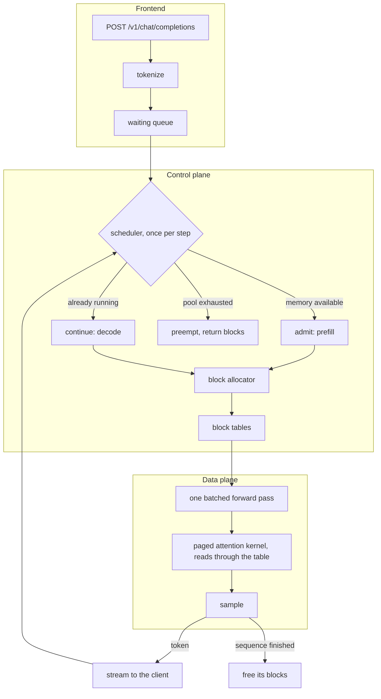

# paged-llm-rs

> LLM inference engine in Rust, served over the OpenAI API. Paged KV cache, continuous batching, attention kernels written in Metal Shading Language for Apple GPUs.

**Status: stage 1 of 8 built.** The model's forward pass runs on the CPU and on Metal, checked against the reference implementation at every module boundary. No throughput number appears below yet, because nothing here has been benchmarked and no number belongs in this file without the command that reproduces it.

## Design

An inference server's throughput is not decided by how fast its matrix multiplications are. Decoding one token reads every weight of the model out of memory, so a single sequence leaves the GPU's arithmetic units idle waiting on bandwidth. Batching is what fixes that: a second sequence rides along on the same weight read, and throughput climbs with the batch until memory runs out.

What runs out is the KV cache. Every token a sequence has seen leaves a key and a value vector per layer that later tokens attend to, and the usual implementation reserves one contiguous buffer per sequence, sized for the longest context it might reach. A request that stops after 100 tokens against a 4096 token reservation wastes 97 % of it, and that waste is exactly the memory a concurrent request needed.

PagedAttention removes the reservation. The cache becomes a pool of fixed-size blocks, each sequence holds a table mapping its logical positions to physical blocks, and blocks are handed out as tokens are produced. The attention kernel then reads keys and values that are scattered across the pool, through the table, instead of walking one contiguous buffer. This is virtual memory applied to attention, page table included, and it is the reason vLLM serves more concurrent requests than the memory arithmetic suggests it should.

The point here is to build that from its primitives. The block allocator, the scheduler that decides what runs on each step, the kernel that reads through a block table, the radix tree that lets two requests with a common prefix share physical blocks: all written in this repository, so the mechanics and their tradeoffs are the deliverable rather than the glue around an inference crate.

## Architecture

The engine is synchronous and owns one model. The server runs on an async runtime and drives it from a blocking pool: a step is a blocking GPU dispatch whatever wraps it, and a synchronous engine stays testable and profilable without a runtime around it.

## What is written here and what is not

candle supplies tensors, safetensors loading and matrix multiplication on Metal. It is infrastructure: a serving engine is not a BLAS, and rewriting one would demonstrate nothing this project is about.

Everything above it is written here, including the model's forward pass. That last part is forced rather than chosen: `candle-transformers` ships Llama and Qwen implementations, and their attention keeps one contiguous KV cache per sequence, which is precisely the thing this project replaces. Writing RMSNorm, RoPE, grouped-query attention and the SwiGLU MLP against candle's primitives is what makes the attention layer able to call a paged kernel at all.

Every kernel ships with a CPU implementation. It is the oracle the GPU version is checked against, and it is also the only path CI can execute: `MTLCreateSystemDefaultDevice` returns nil inside GitHub's hosted macOS runners, so a hosted job compiles the Metal path and stops there.

## The forward pass, and how it is known to be right

Qwen3 differs from Llama in three ways that do not fail loudly. An RMS norm is applied to the query and key vectors, per head, before the rotation. The head width is a field of its own rather than `hidden_size / num_attention_heads`, and on Qwen3-0.6B those disagree: 128 against 64, which is why `q_proj` is 1024 by 2048 and not square. And sixteen query heads read eight key heads, so how the groups are expanded decides which head reads which. Get any of them wrong and the model loads, runs, and writes fluent text that the checkpoint did not mean.

So the check is not the logits. It is every module boundary, against activations dumped from the HuggingFace implementation by `scripts/dump_reference.py`, at two scales that answer different questions.

The small one is two layers at toy widths with weights from a fixed seed, and it is committed under `crates/pagedllm/tests/fixtures/tiny`. Its widths are chosen against specific mistakes: the head width is 16 where the quotient is 8, the grouping ratio is 2, and no matrix is square, so a transposed weight cannot pass by accident. At 184 KB it runs in CI on the CPU path, which is what makes structural correctness something the repository checks rather than something this file claims.

    make fixtures && cargo test

The full-scale one is Qwen3-0.6B itself, 452 tensors across 28 layers, not committed because the checkpoint is 1.5 GB.

    make venv model reference test-model

| what runs | against | worst relative difference |
|-----------|---------|---------------------------|
| f32 on the CPU | f32 reference | 9.368e-6 |
| f32 on Metal | f32 reference | 9.882e-6 |
| bf16 on Metal | bf16 reference | 6.800e-2 |

The first two rows are the point of the third. Holding the dtype at f32 and changing only the backend moves nothing, so the implementation is right on both and the gap in bf16 belongs to the dtype rather than to the code. Reading the bf16 row without them would leave that undecided.

### What bf16 costs, and why the test does not assert tokens match

Against the f32 reference, bf16 moves the greedy token at 2 of the 10 positions in the test prompt. That is not a defect and it is not hidden: the two positions it moves are the ones where the top two logits sit 0.075 and 0.071 apart, while every position the two agree on is decided by 0.49 or more, and the position generation would actually consume is decided by 8.36.

So the test asserts the thing that distinguishes a bug from arithmetic. It measures how far the logits of two bf16 runs sit apart, and requires that any position where they disagree is one the reference itself decided by less than that. A rounding difference flips ties and nothing else; a defect flips a position that was not close. Six of the ten positions are decided by more than the measured noise, so the assertion has something to hold.

Each of these tests was checked to fail with the defect it exists for put back: the query and key norms removed, applied after the rotation instead of before, the key heads interleaved rather than grouped, the rotary halves paired the other way, and the two MLP branches swapped. All five are caught, by both the committed fixture and the full-scale comparison. A test that has never failed is not evidence.

## Build order

Each stage lands with its tests before the next one starts.

1. **Model forward pass** (built): safetensors loading, RMSNorm, RoPE, grouped-query attention with the query and key norms Qwen3 adds, SwiGLU, on candle primitives. Checked against the reference implementation at every module boundary.
2. **Server** (planned): OpenAI-compatible `/v1/completions` and `/v1/chat/completions`, streamed over server-sent events, one request at a time.
3. **Continuous batching, contiguous cache** (planned): the queue, the scheduler and the step loop, against a KV cache that is still one reserved buffer per sequence. This is the baseline the paged version has to beat, and it is measured before it is replaced.
4. **Block allocator** (planned): the paged layout as pure logic, no GPU involved, allocation, release, reference counting and block tables, fully unit tested.
5. **Paged attention kernel** (planned): the Metal kernel that reads keys and values through a block table, and its integration into the attention layer.
6. **Benchmarks and profiling** (planned): against `llama-server` and `mistral.rs` on the same machine with the same model, plus a GPU profile of the kernel. The delta between stages 3 and 5 is the headline result.
7. **Prefix caching** (planned): a radix tree over block hashes, so requests sharing a system prompt share physical blocks instead of recomputing them.
8. **Chunked prefill** (planned): a long prompt processed a slice per step, so an arriving request stops adding a latency spike to every sequence already decoding.

Quantized KV cache blocks and speculative decoding are not in the plan. They enter it if a measurement asks for them.

## Hardware and what it constrains

Development and measurement run on an Apple M4 Pro: 12 CPU cores, 16 GPU cores, 24 GB of unified memory at 273 GB/s.

Unified memory is what makes this different from a discrete GPU, and it cuts both ways. Weights do not have to be copied across a bus, but the block pool competes with the operating system for the same RAM, so sizing it is a real decision rather than a fraction of a dedicated VRAM budget. Bandwidth is the other constraint: 273 GB/s sets the ceiling on decode throughput before a single kernel is written.

Kernels are compiled from Metal Shading Language at startup rather than ahead of time, so building this repository needs no Xcode installation. Xcode is used for profiling with Instruments, which is a tool outside the crate rather than a dependency of it.

## Repository layout

    crates/pagedllm/            engine: model, scheduler, block allocator, kernels
    crates/pagedllm/src/model/  the Qwen3 forward pass on candle primitives
    crates/pagedllm/tests/      the comparison against the reference, and its fixture
    crates/pagedllm-server/     OpenAI-compatible HTTP server
    scripts/                    the reference dump the tests are checked against
    Makefile                    build, test and lint entry points

## Development

Requires a stable Rust toolchain; `rust-toolchain.toml` pins the channel and the components.

    make build       release build with the Metal backend
    make server      start the server
    make test        the CPU path, which is what CI runs
    make test-metal  adds the tests that need a Metal device
    make lint        rustfmt check, then clippy with warnings denied on both feature sets

The full-scale comparison needs three things the repository does not carry, in this order:

    make venv        a virtualenv with torch and transformers, for the oracle
    make model       Qwen3-0.6B from HuggingFace, 1.5 GB
    make reference   the reference activations, dumped in f32 and in bf16
    make test-model  the comparison itself

`make fixtures` regenerates the committed small fixture, so a change to the oracle becomes a change to the repository rather than to one machine.

## License

MIT
