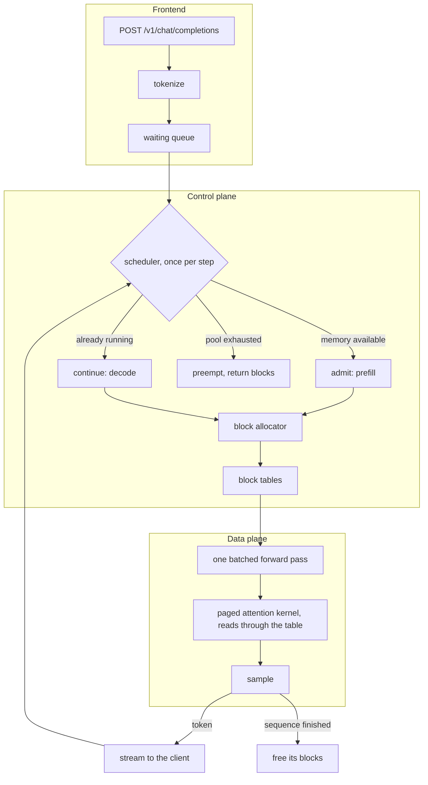

# paged-llm-rs

> LLM inference engine in Rust, served over the OpenAI API. Paged KV cache, continuous batching, attention kernels written in Metal Shading Language for Apple GPUs.

**Status: stage 6 of 8 built.** The forward pass runs on the CPU and on Metal, checked against the reference implementation at every module boundary, an `OpenAI`-compatible server generates from it over HTTP with streaming, and a scheduler advances many sequences on one forward pass against a KV cache that is a pool of blocks, and a hand-written Metal kernel reads that pool in place. Every layout it replaced is still reachable by a flag, so the figures below compare them without a checkout, and each gain is measured on its own. It is also measured against `llama.cpp` and `mistral.rs` on this machine, by the same client, including where it loses.

## Design

An inference server's throughput is not decided by how fast its matrix multiplications are. Decoding one token reads every weight of the model out of memory, so a single sequence leaves the GPU's arithmetic units idle waiting on bandwidth. Batching is what fixes that: a second sequence rides along on the same weight read, and throughput climbs with the batch until memory runs out.

What runs out is the KV cache. Every token a sequence has seen leaves a key and a value vector per layer that later tokens attend to, and the usual implementation reserves one contiguous buffer per sequence, sized for the longest context it might reach. A request that stops after 100 tokens against a 4096 token reservation wastes 97 % of it, and that waste is exactly the memory a concurrent request needed.

PagedAttention removes the reservation. The cache becomes a pool of fixed-size blocks, each sequence holds a table mapping its logical positions to physical blocks, and blocks are handed out as tokens are produced. The attention kernel then reads keys and values that are scattered across the pool, through the table, instead of walking one contiguous buffer. This is virtual memory applied to attention, page table included, and it is the reason vLLM serves more concurrent requests than the memory arithmetic suggests it should.

The point here is to build that from its primitives. The block allocator, the scheduler that decides what runs on each step, the kernel that reads through a block table, the radix tree that lets two requests with a common prefix share physical blocks: all written in this repository, so the mechanics and their tradeoffs are the deliverable rather than the glue around an inference crate.

## Architecture



The engine is synchronous and owns one model. The server runs on an async runtime and drives it from a blocking pool: a step is a blocking GPU dispatch whatever wraps it, and a synchronous engine stays testable and profilable without a runtime around it.

## What is written here and what is not

candle supplies tensors, safetensors loading and matrix multiplication on Metal. It is infrastructure: a serving engine is not a BLAS, and rewriting one would demonstrate nothing this project is about.

Everything above it is written here, including the model's forward pass. That last part is forced rather than chosen: `candle-transformers` ships Llama and Qwen implementations, and their attention keeps one contiguous KV cache per sequence, which is precisely the thing this project replaces. Writing RMSNorm, RoPE, grouped-query attention and the SwiGLU MLP against candle's primitives is what makes the attention layer able to call a paged kernel at all.

Every kernel ships with a CPU implementation. It is the oracle the GPU version is checked against, and it is also the only path CI can execute: `MTLCreateSystemDefaultDevice` returns nil inside GitHub's hosted macOS runners, so a hosted job compiles the Metal path and stops there.

## The forward pass, and how it is known to be right

Qwen3 differs from Llama in three ways that do not fail loudly. An RMS norm is applied to the query and key vectors, per head, before the rotation. The head width is a field of its own rather than `hidden_size / num_attention_heads`, and on Qwen3-0.6B those disagree: 128 against 64, which is why `q_proj` is 1024 by 2048 and not square. And sixteen query heads read eight key heads, so how the groups are expanded decides which head reads which. Get any of them wrong and the model loads, runs, and writes fluent text that the checkpoint did not mean.

So the check is not the logits. It is every module boundary, against activations dumped from the HuggingFace implementation by `scripts/dump_reference.py`, at two scales that answer different questions.

The small one is two layers at toy widths with weights from a fixed seed, and it is committed under `crates/pagedllm/tests/fixtures/tiny`. Its widths are chosen against specific mistakes: the head width is 16 where the quotient is 8, the grouping ratio is 2, and no matrix is square, so a transposed weight cannot pass by accident. At 184 KB it runs in CI on the CPU path, which is what makes structural correctness something the repository checks rather than something this file claims.

    make fixtures && cargo test

The full-scale one is Qwen3-0.6B itself, 452 tensors across 28 layers, not committed because the checkpoint is 1.5 GB.

    make venv model reference test-model

| what runs | against | worst relative difference |
|-----------|---------|---------------------------|
| f32 on the CPU | f32 reference | 9.368e-6 |
| f32 on Metal | f32 reference | 9.882e-6 |
| bf16 on Metal | bf16 reference | 6.800e-2 |

The first two rows are the point of the third. Holding the dtype at f32 and changing only the backend moves nothing, so the implementation is right on both and the gap in bf16 belongs to the dtype rather than to the code. Reading the bf16 row without them would leave that undecided.

### What bf16 costs, and why the test does not assert tokens match

Against the f32 reference, bf16 moves the greedy token at 2 of the 10 positions in the test prompt. That is not a defect and it is not hidden: the two positions it moves are the ones where the top two logits sit 0.075 and 0.071 apart, while every position the two agree on is decided by 0.49 or more, and the position generation would actually consume is decided by 8.36.

So the test asserts the thing that distinguishes a bug from arithmetic. It measures how far the logits of two bf16 runs sit apart, and requires that any position where they disagree is one the reference itself decided by less than that. A rounding difference flips ties and nothing else; a defect flips a position that was not close. Six of the ten positions are decided by more than the measured noise, so the assertion has something to hold.

A test that has never failed is not evidence, so the tests are tested. `scripts/mutate.py` puts each defect back into the source, runs the suites, and restores it:

    make mutate

    mutation                                                              fixture  reference
    ----------------------------------------------------------------------------------------
    query and key norms dropped, the Llama-shaped attention                caught     caught
    query and key norms applied after the rotation instead of before       caught     caught
    key heads interleaved across query heads instead of grouped            caught     caught
    rotary halves paired the other way round                               caught     caught
    the MLP gate and up branches swapped                                   caught     caught

It refuses to start on a working tree with uncommitted changes to the files it rewrites, restores them whether the run passed, failed or crashed, and reports a mutation whose anchor has moved as a failure rather than skipping it, since a mutation that no longer applies is one nothing is checking.

## Serving the `OpenAI` API

    make server

```console
$ curl localhost:8000/v1/chat/completions -H 'content-type: application/json' -d '{
    "messages": [{"role": "user", "content": "Name three prime numbers."}],
    "max_tokens": 64, "temperature": 0,
    "chat_template_kwargs": {"enable_thinking": false}
  }'
{"id":"chatcmpl-...","object":"chat.completion","model":"Qwen3-0.6B",
 "choices":[{"index":0,"message":{"role":"assistant",
   "content":"Three prime numbers are **2, 3, and 5**."},"finish_reason":"stop"}],
 "usage":{"prompt_tokens":17,"completion_tokens":16,"total_tokens":33}}
```

`/v1/completions`, `/v1/chat/completions`, `/v1/models` and `/health`, with `"stream": true` serving server-sent events terminated by `[DONE]`, which is what every client watches for. The engine runs on its own thread and the HTTP layer reaches it by sending a job and reading events off a channel, so a disconnected client stops costing GPU time at the next token rather than at the end of its budget.

### What is refused, and why that is the feature

`temperature`, `top_p`, `top_k`, `max_tokens`, `seed` and `stream` are honoured. Everything else the schema allows is parsed in order to be refused with a 400 naming it: `n` above one, `stop`, `tools`, `logit_bias`, `logprobs`, `response_format` and the two penalties. A server that accepts `frequency_penalty` and ignores it answers a different question than it was asked, and the client has no way to find out. What a client sends meaning "default" gets through, so `n: 1` and a penalty of zero are not refusals.

The sampling defaults come from the model's own `generation_config.json`, which for Qwen3 is temperature 0.6, top-p 0.95 and top-k 20, and the server prints them at startup. A request that names a parameter still wins. Serving at the `OpenAI` default of temperature 1 instead would answer a noticeably different question than the model was tuned for.

Chat messages are turned into text by the model's own Jinja template, rendered with `minijinja` and the Python compatibility layer its string methods need. This is checked rather than trusted: `crates/pagedllm/tests/fixtures/chat` holds the template and thirty renderings taken from the reference implementation, covering the system prompt, multiple turns, reasoning blocks and Unicode, and the test requires all thirty to match byte for byte. Without the compatibility layer, all thirty fail on the template's first `startswith`.

`enable_thinking` reaches the template through `chat_template_kwargs`, and is left undefined unless a request sets it, which is what the template treats as reasoning turned on. Qwen3 therefore reasons out loud by default, at some length for a model this size. Turning that off silently would be this server quietly answering a different question than the model was asked.

### What one sequence costs

    make smoke

Apple M4 Pro, Metal, Qwen3-0.6B in bf16, one request at a time, greedy prompt of five tokens:

| tokens generated | seconds | tokens/s | ms per token |
|------------------|---------|----------|--------------|
| 16 | 0.23 | 71.0 | 14.08 |
| 64 | 1.00 | 64.1 | 15.61 |
| 128 | 2.31 | 55.4 | 18.05 |
| 256 | 5.96 | 43.0 | 23.28 |
| 512 | 17.26 | 29.7 | 33.71 |
| 1024 | 56.65 | 18.1 | 55.32 |

Time to first token is 42 ms and the server is reachable 0.9 s after launch.

The shape of that table is the result, not the peak figure. A token costs 14 ms at the start of a sequence and 55 ms a thousand tokens later, four times as much, and both the attention and the cache grow with the sequence. What this measurement does not do is separate them: appending one token to a contiguous cache copies everything already in it, and attending over the cache reads all of it, and both are linear in the length. Stage 6 profiles that; guessing at it here would be the kind of claim this README is written to avoid.

What it is enough to say now is that this is the baseline. The cache is one unbroken run of memory per sequence, grown by reallocating, which is the layout stage 5 replaces with a pool of fixed-size blocks. Measuring it before replacing it is the point of building it this way.

## Continuous batching, and what a reservation costs

    make bench-concurrency

The scheduler hands out blocks from a pool allocated once. A sequence holds a
list of blocks rather than a run of memory, and takes another only when its last
one fills. Admission comes first and takes the whole pass, so a prompt arriving
stalls everything already decoding, which is the design vLLM shipped before
chunked prefill and the stall stage 8 removes. When the pool runs dry the newest
resident sequence is evicted, its blocks are returned, and it goes back to the
front of the queue to be recomputed. Waiting instead would deadlock: if every
resident sequence needs a block and none can finish without one, nothing frees
anything.

The contiguous cache is not gone, it is a setting. `--block-size 1024` on a
1024-token context gives every sequence exactly one block, which is a
reservation, and `--block-size 16` is paging. Same pool, same memory, same
everything else, so the two are one flag apart.

Apple M4 Pro, Metal, Qwen3-0.6B in bf16, 3584 MiB of cache either way, prompts of
about ten words and 128 tokens each:

| clients | reservation | paging | paging and kernel |
|---------|-------------|--------|-------------------|
| 1 | 51.4 tok/s | 48.0 | 58.2 |
| 4 | 64.0 | 91.9 | 124.9 |
| 16 | 68.4 | 131.4 | 253.8 |
| 32 | 69.6 | 149.7 | 367.7 |
| 64 | 68.3 | 152.6 | **447.9** |
| ttft at 64 | **30 187 ms** | 1079 ms | 983 ms |
| p95 at 64 | 119.80 s | 53.67 s | **18.26 s** |

Three things in that table, and the last one is the point.

The two gains are separate, and separating them is why the block allocator was
wired into the serving path at stage 4 rather than kept as pure logic until the
kernel arrived. Paging alone buys 2.2 times the throughput; the kernel on top of
paging buys 2.9 times again. Neither number is carrying the other's weight, and a
single 6.6 would have hidden which half came from where.

Scaling says the same thing another way. From one client to sixty-four, the
reservation gains 1.4 times, paging 3.2, and the kernel 7.7. A serving engine
that does not scale with concurrency is not serving, it is queueing.

And the row that says why paging exists. At 3584 MiB a reservation of 1024
tokens buys thirty-two of them, so the thirty-third client waits for someone to
finish: thirty seconds before its first token, against 976 milliseconds. The same
memory in blocks of sixteen holds 32 768 tokens, which is 237 sequences of the
length these requests actually reach. The ceiling moved by a factor of seven, and
nothing about the model or the kernel changed to move it.

### What paging costs, and what it happens to save

    cargo run --release --features metal --example step_cost -- models/Qwen3-0.6B

| rows | reservation, ms a row | paging, ms a row |
|------|-----------------------|------------------|
| 1 | 29.3 | 27.0 |
| 8 | 18.0 | 14.6 |
| 32 | 19.4 | 14.6 |

Paging was expected to cost something on the read path, since a sequence's
history is now scattered and has to be gathered. It does not: it is 24 % cheaper.
The reason is visible once the shapes are written down. Gathering reads whole
blocks, and a reservation's block is the whole reservation, so a sequence 257
tokens long drags 1024 tokens through the copy. Seventeen blocks of sixteen drag
272. The bookkeeping that paging adds is smaller than the copying it removes.

The waste it replaces is also bounded rather than open. A sequence holds at most
one partly-filled block, sixteen tokens at 112 KiB each, where a reservation
holds everything the request never reaches.

## The kernel, and the question it answered

    cargo run --release --features metal --example step_cost -- models/Qwen3-0.6B

Stage 3 measured something it could not explain: a decode step cost the same per
row whatever the batch, where batching should make it nearly free, since a step
reads the model's weights once however many sequences ride along. Two fixes
halved the number without changing the shape of the curve, and the question went
into the log with a note that the next measurement should be a profile.

It did not need one. The cost was the gather.

| rows | reservation, ms a row | paging, ms a row | kernel, ms a row |
|------|-----------------------|------------------|------------------|
| 1 | 31.2 | 28.4 | 17.6 |
| 4 | 21.0 | 18.0 | 9.0 |
| 8 | 18.6 | 15.3 | 4.6 |
| 32 | 20.4 | 14.3 | **2.1** |

The first two columns are flat: every sequence added to a batch costs another
full pass. The third falls, which is what batching is supposed to do. At
thirty-two rows the whole step takes 66.5 ms against 458.8, and 59.4 ms is what
the same thirty-two rows cost as one sequence's prompt, which is the shape stage
3 said a decode should have had all along. The 17-fold gap it reported is now
1.12.

What the tensor path does, per layer and per step, is copy every resident
sequence's keys and values into one rectangle as wide as the longest row, then
multiply. The copy is proportional to the batch, so it cancels exactly the thing
batching buys. The kernel reads the blocks where they are.

### What the kernel is, and how it is known to be right

One threadgroup per (row, head), and the work splits three ways, each chosen for
how the reads land.

Scoring gives one position to each SIMD group and splits the head across its
thirty-two lanes, so a group reads thirty-two consecutive floats of a key vector
at a time and `simd_sum` finishes the dot product with no barrier. The softmax
runs over the scores in threadgroup memory in f32, which is what keeps a few
thousand exponentials from losing their sum in bf16. The weighted sum of the
value vectors gives one output dimension to each thread, so the threads of a
group again read consecutive floats.

The kernel is compiled from Metal Shading Language at startup, so building this
repository needs no Xcode, and cached per dtype.

Three implementations of one function exist, and each pair says something the
others cannot.

    make test          the scalar reference against the tensor path
    make test-metal    adds the kernel against both, on hardware

The tensor path gathers and multiplies, and knows nothing about block tables. The
scalar reference walks the table token by token; it is the oracle, and it is what
CI runs, because `MTLCreateSystemDefaultDevice` returns nil inside a hosted macOS
runner. The kernel does what the scalar reference does, in parallel. On the GPU
it agrees with the tensor path to 1.0e-7, which is f32 rounding.

Comparing only two of them would miss a defect that moved both the same way. That
is not hypothetical here: a reshape that split every key vector across head
boundaries passed two differential tests at stage 4, because both sides were
wrong identically, and only the comparison against a path that had never touched
the pool caught it.

### `unsafe_code = "deny"` still holds

The whole kernel path goes through safe wrappers candle already exposes:
`metal_device()` to compile the source, `command_encoder()` to encode into
candle's own command buffer, `set_param` to bind the buffers, `dispatch_threads`
to launch. No module in this workspace has taken the opt-out.

Encoding into candle's command buffer rather than a private one is also what
makes the ordering correct without a barrier written by hand: candle tracks which
buffers a kernel wrote and inserts the barrier before the next one reads them.

## Against the other engines, same machine, same client

    make bench-engines

`guidellm` sends the load and reads the results. A number produced by a harness
written here would be a number about this repository; guidellm is standalone,
speaks the `OpenAI` API, and is what people already point at other servers, so
all three engines are driven by the same client with the same flags.

Held equal: Qwen3-0.6B in bfloat16 everywhere, llama.cpp on the BF16 GGUF
conversion of this same checkpoint rather than a quantised one; the same context;
the same KV cache budget where the engine exposes one; prompts of exactly 128
tokens and exactly 128 tokens asked for, with no spread. What is not held equal
is the sampler, because each engine's arithmetic picks its own tokens, which
changes nothing about a rate.

Apple M4 Pro, macOS 26.5, llama.cpp b10180, mistral.rs 0.9.0.

**Output tokens a second**

| clients | paged-llm-rs | llama.cpp | mistral.rs |
|---------|--------------|-----------|------------|
| 1 | 80.7 | **139.3** | 129.8 |
| 4 | 175.3 | **389.3** | 222.8 |
| 16 | 327.7 | **621.2** | 565.3 |
| 32 | 478.5 | **686.2** | 342.0 |
| 64 | 644.3 | **771.4** | 26.8 (see below) |

**Time to first token, median**

| clients | paged-llm-rs | llama.cpp | mistral.rs |
|---------|--------------|-----------|------------|
| 1 | **25 ms** | 61 ms | 28 ms |
| 16 | **114 ms** | 616 ms | 190 ms |
| 32 | **242 ms** | 1263 ms | 675 ms |
| 64 | **500 ms** | 2092 ms | 786 ms |

Read honestly, that says three things.

**llama.cpp is faster on throughput at every level, and this engine does not
catch it.** Its Metal kernels have been hand-tuned for years and this one is a
few hundred lines old. The gap does narrow as concurrency rises, from 1.7 times
at one client to 1.2 at sixty-four, which says the scheduler is doing its job
while the kernels are not yet doing theirs.

**This engine answers first, by a widening margin.** At sixty-four clients
llama.cpp takes two seconds to produce a first token and this one takes half a
second. That is a design choice showing up in a measurement rather than a
surprise: admission runs before decoding, so a request that arrives starts on the
next pass instead of waiting for a batch to turn over. It is the same choice that
costs throughput, because a pass spent on a prompt is a pass not spent on tokens.

**mistral.rs collapses past sixteen clients**, from 565 tokens a second to 342
and then to 26.8, with a p95 of 33 seconds. It is the closest of the three at low
load and the only one that does not survive the climb.

Two things about its column are worth saying plainly, because both weaken it and
both were found by checking the run rather than reading the table. Its
sixty-four-client figure rests on six requests that finished out of sixty-nine,
where the other two finished a hundred and nine and a hundred and one at the same
level, so the collapse is certain and the number is thin. And it produced 115 to
124 tokens a request where the other two produced exactly the 128 asked for,
which is a tenth less work delivered per request. A rate is still a rate, but the
engines were not given the same thing to finish.

### The comparison that is missing, and why

The interesting comparison here was two paged attention implementations on the
same GPU. It is not in the table because mistral.rs's does not run: with
`--paged-attn on` it serves four concurrent requests and stops answering at
sixteen, connections accepted and never served, the process at 0 % CPU. The same
sixteen requests with `--paged-attn off` complete in 25 seconds. So its numbers
above are taken at its working setting, and a reader who sees it lose should know
it was not running the configuration this project wanted to be measured against.

That was isolated rather than assumed: one request answers, sixteen concurrent
streaming requests answer, a bounded four-stream benchmark completes in 30
seconds, and sixteen hangs. The flag is the difference.

It also cost the shape of this benchmark. guidellm's `sweep` profile calibrates
its own concurrency range and is the better instrument; its last phase sends
without bound, and mistral.rs stops answering under it. A fixed grid every engine
survives is worth more than a shape one of them cannot be measured at.

## Where a decode step's time goes

    make profile

A Metal System Trace of the server under sixteen concurrent requests, summarised
into `docs/decode-profile.txt`. The trace itself is not committed: eight seconds
of it is a hundred megabytes, which is the line between an artifact worth
committing and one worth reproducing.

A decode step reads all 1.50 GB of weights whatever the batch, so unified memory
at 273 GB/s puts a floor of 5.5 ms under it however fast the arithmetic gets.
What the trace adds is what the step is made of: **about 150 command buffer
submissions, roughly five per layer**, each a round trip that the floor does not
account for.

That is the shape of the remaining gap, and it is not in the attention any more.
Stage 5 removed the copy that made batching pointless; what is left is the
granularity at which candle hands work to the GPU, which no kernel written here
can change. Fusing a layer's projections into fewer dispatches is the next thing
a measurement would ask for, and it is a change to how the model calls candle
rather than to the kernel.

One caveat the summary states rather than hides: recording slows the process it
records, so the tokens a second inside the trace are well under what the same
load reaches untraced, and the millisecond figure for a step is inflated with
them. The submissions per step are not, because both rates fall together and
their ratio survives, and that ratio is what the profile is for.

## Build order

Each stage lands with its tests before the next one starts.

1. **Model forward pass** (built): safetensors loading, RMSNorm, RoPE, grouped-query attention with the query and key norms Qwen3 adds, SwiGLU, on candle primitives. Checked against the reference implementation at every module boundary.
2. **Server** (built): `OpenAI`-compatible `/v1/completions` and `/v1/chat/completions`, streamed over server-sent events, one request at a time, against a KV cache for one sequence.
3. **Continuous batching, contiguous cache** (built): the queue, the scheduler and the step loop, against a pool of pre-allocated slots, one reserved buffer per resident sequence. This is the baseline the paged version has to beat, and it is measured before it is replaced.
4. **Block allocator** (built): the paged layout as pure logic, no GPU involved, allocation, release and block tables, fully unit tested, and wired into the serving path so the memory it buys is measured before the kernel arrives.
5. **Paged attention kernel** (built): the Metal kernel that reads keys and values through a block table on a decode step, compiled from source at startup, checked against a scalar reference and against the tensor path it replaces.
6. **Benchmarks and profiling** (built): against `llama-server` and `mistral.rs` on this machine with the same model, driven by `guidellm`, plus a Metal System Trace of a decode step.
7. **Prefix caching** (planned): a radix tree over block hashes, so requests sharing a system prompt share physical blocks instead of recomputing them.
8. **Chunked prefill** (planned): a long prompt processed a slice per step, so an arriving request stops adding a latency spike to every sequence already decoding.

Quantized KV cache blocks and speculative decoding are not in the plan. They enter it if a measurement asks for them.

## Hardware and what it constrains

Development and measurement run on an Apple M4 Pro: 12 CPU cores, 16 GPU cores, 24 GB of unified memory at 273 GB/s.

Unified memory is what makes this different from a discrete GPU, and it cuts both ways. Weights do not have to be copied across a bus, but the block pool competes with the operating system for the same RAM, so sizing it is a real decision rather than a fraction of a dedicated VRAM budget. Bandwidth is the other constraint: 273 GB/s sets the ceiling on decode throughput before a single kernel is written.

Kernels are compiled from Metal Shading Language at startup rather than ahead of time, so building this repository needs no Xcode installation. Xcode is used for profiling with Instruments, which is a tool outside the crate rather than a dependency of it.

## Repository layout

    crates/pagedllm/            engine: model, cache, sampler, scheduler, kernels
    crates/pagedllm/src/model/    the Qwen3 forward pass on candle primitives
    crates/pagedllm/src/kernels/  the Metal kernel and the scalar reference beside it
    crates/pagedllm/tests/      the comparisons against the reference, and their fixtures
    crates/pagedllm-server/     OpenAI-compatible HTTP server on axum
    scripts/                    the reference dumps, the mutation run, the benchmarks
    docs/                       the profile summary the README cites
    Makefile                    build, test and lint entry points

## Development

Requires a stable Rust toolchain; `rust-toolchain.toml` pins the channel and the components.

    make build       release build with the Metal backend
    make server      start the server
    make server      start the server on port 8000
    make test        the CPU path, which is what CI runs
    make test-metal  adds the tests that need a Metal device, the kernel among them
    make smoke       drive the server over HTTP and print its throughput
    make bench-concurrency   what batching buys and what the reservation costs
    make bench-engines       against llama.cpp and mistral.rs, driven by guidellm
    make profile             a Metal System Trace of a decode step
    make mutate      put each defect back and check the tests fail
    make lint        rustfmt check, then clippy with warnings denied on both feature sets

The full-scale comparison needs three things the repository does not carry, in this order:

    make venv        a virtualenv with torch, transformers and guidellm
    make model       Qwen3-0.6B from HuggingFace, 1.5 GB
    make reference   the reference activations, dumped in f32 and in bf16
    make test-model  the comparison itself

`make fixtures` regenerates the committed small fixture, so a change to the oracle becomes a change to the repository rather than to one machine.

## License

MIT
